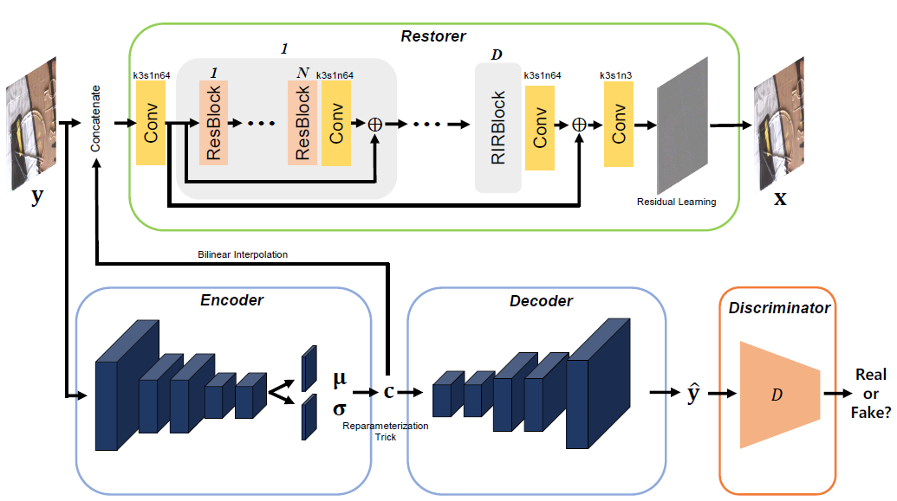
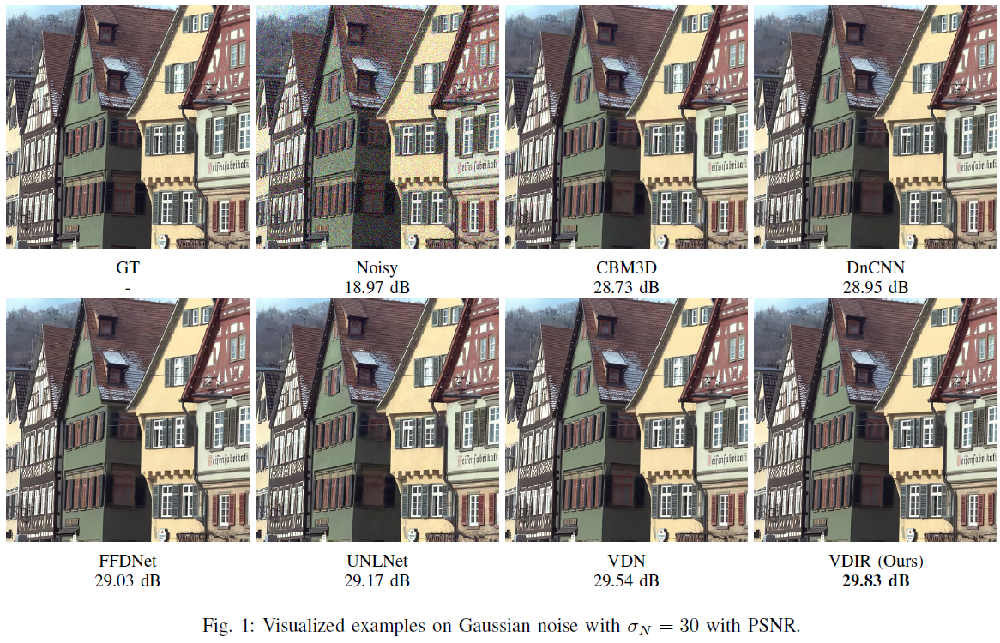

# VDIR
# Variational Deep Image Restoration & <p> [Variational Deep Image Denoising](https://arxiv.org/pdf/2104.00965.pdf)

Jae Woong Soh and Nam Ik Cho

VDID [[Arxiv](https://arxiv.org/abs/2104.00965)]

## Environments
- Ubuntu 18.04
- [Tensorflow](http://www.tensorflow.org/) (>=1.8)
- CUDA 11.2 & cuDNN
- Python 3.7

## Abstract (VDID)

Convolutional neural networks (CNNs) have shown outstanding performance on image denoising with the help of large-scale datasets. Earlier methods naively trained a single CNN with many pairs of clean-noisy images. However, the conditional distribution of the clean image given a noisy one is too complicated and diverse, so that a single CNN cannot well learn such distributions. Therefore, there have also been some methods that exploit additional noise level parameters or train a separate CNN for a specific noise level parameter. These methods separate the original problem into easier sub-problems and thus have shown improved performance than the naively trained CNN. In this step, we raise two questions. The first one is whether it is an optimal approach to relate the conditional distribution only to noise level parameters. The second is what if we do not have noise level information, such as in a real-world scenario. To answer the questions and provide a better solution, we propose a novel Bayesian framework based on the variational approximation of objective functions. This enables us to separate the complicated target distribution into simpler sub-distributions. Eventually, the denoising CNN can conquer noise from each sub-distribution, which is generally an easier problem than the original. Experiments show that the proposed method provides remarkable performance on additive white Gaussian noise (AWGN) and real-noise denoising while requiring fewer parameters than recent state-of-the-art denoisers.
<br><br>

## Brief Description of Our Proposed Method

### <u>Overall Network Architecture</u>

<p align="center"></p>

The overall architecture of proposed VDID, where <i><b>k</b></i>, <b><i>s</i></b>, and <i><b>n</i></b> denote kernel size, stride, and the number of filters.

## Experimental Results

**Results on Additive White Gaussian Noise (AWGN)**

<p align="center"></p>

**Results on Real-Noise (SIDD/DND)**

<p align="center"></p>

## Additional Visualized Results

<p align="center"></p>
<p align="center"></p>
<p align="center"></p>

## Guidelines for Codes

**Requisites should be installed beforehand.**

Clone this repo.
```
git clone http://github.com/JWSoh/VDIR.git
cd VDIR/
```

### Training

Download training dataset [DIV2K](https://data.vision.ee.ethz.ch/cvl/DIV2K/).

Download training dataset [SIDD](https://www.eecs.yorku.ca/~kamel/sidd/).

### Generate TFRecord dataset

**AWGN Denoising Dataset**

- Run generate_AWGN.py with proper clean image path.
```
python generate_AWGN.py --labelpath DIV2K_train_HR/*.png
```

**Real-Noise Denoising Dataset**

- Refer to the codes of [CBDNet](https://github.com/GuoShi28/CBDNet) to synthesize real-noise to DIV2K dataset.

	---> Use MATLAB code 'utils/AddNoiseMosai.m'

- Run generate_REAL.py with proper paths.
```
python generate_REAL.py --labelpath DIV2K_train_HR/*.png --datapath DIV2K_train_REAL_NOISE/*.png --labelpath2 SIDD/GT/*.PNG --datapath2 SIDD/NOISY/*.PNG
```

### Train VDID

**AWGN Denoising**

- Run train_AWGN.py.

[Options]
```
python train_AWGN.py --gpu [GPU_number] --trial [Trial of your training] --step [Global step]

--gpu: If you have more than one gpu in your computer, the number denotes the index. [Default 0]
--trial: Trial number. Any integer numbers can be used. [Default 0]
--step: Global step. When you resume the training, you need to specify the right global step. [Default 0]
```

**Real-Noise Denoising**

- Run train_REAL.py.

```
python train_REAL.py --gpu [GPU_number] --trial [Trial of your training] --step [Global step]
```


### Test

[Options]
```
python main.py --gpu [GPU_number] --model [Type of model] --inputpath [dataset path] --dataset [dataset name] --sigma [noise level]  --noisy

--gpu: If you have more than one gpu in your computer, the number designates the index of GPU which is going to be used. [Default 0]
--model: Type of pretrained model for the test. Choices: ['model-AWGN', 'model-Real_Noise']. [Default: 'model-AWGN']
--inputpath: Path of input images [Default: dataset]
--dataset: Name of the dataset [Default: Kodak24]
--sigma: Noise level (Effective only for AWGN) [Default: 10]

--noisy: A flag whether input images are clean images or noisy images.
	-> input as a clean image to synthesize a noisy image which will be fed to the network.
	-> input as a noisy image directly fed to the network.
```

## Citation
```
@article{soh2021variational,
  title={Variational Deep Image Denoising},
  author={Soh, Jae Woong and Cho, Nam Ik},
  journal={arXiv preprint arXiv:2104.00965},
  year={2021}
}
```